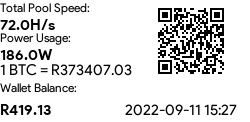

# Display NiceHash Stats On EPaper Display

Original version was written in `C` but reworked in `Python`, i originally built my own hardware wallet using some source code online with personal modifications and rendered hardware wallet stats on my Waveshare `2.13inch_e-Paper` display.

In this repo this code looks at `Nicehash` and using my `Nicehash` module from `PyPi` render stats on the EPaper Display.

### Getting Started 

Using a RPI Zero

- Read Manual for setting up 

[Manual for Waveshare 2.13inch_e-Paper](https://www.waveshare.com/w/upload/d/d5/2.13inch_e-Paper_Specification.pdf)

Some additional options must be enabled using

`sudo raspi-config`

I will leave it up to you to find that!

- Install requirements

`pip3 install -r requirements.txt`

- Fetch API keys from NiceHash and inject it in `renderstats.py`
```
host =              'https://api2.nicehash.com'
organisation_id =   'supersecret'
key =               'supersecret'
secret =            'supersecret'
walletaddress =     'mywalletaddress'
```

- Edit code according to your fancy

- Run application

`python3 app.py`

- Run some cron job to make it work on `@reboot`!

`sudo crontab -e` 


### Display Output




